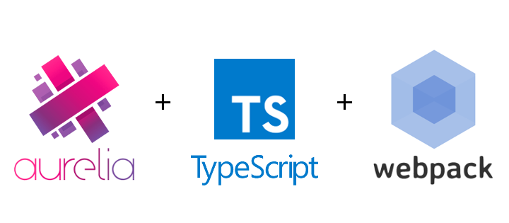

  

 

# Aurelia + TypeScript + Webpack Starter Kit

A minimal [Aurelia][aurelia] starter kit written in [TypeScript][typescript] and
built using [webpack][webpack].

## Building

The project can be built by running `npm run build` which will assemble the
distribution under the `./dist` directory. This directory can be cleaned by
running `npm run clean`.

## Developing

The [webpack-dev-server][dev-server] is installed for development purposes and
can be run with the command `npm run dev`. This will start the development
server at [`http://localhost:8080`][localhost] and open it in your browser, with
[inline mode][inline] and [hot module replacement][hmr] enabled.

## License

This project is available under the terms of the ISC license. See the
[`LICENSE`][license] file for the copyright information and licensing terms.

[aurelia]: http://aurelia.io/
[webpack]: https://webpack.github.io/
[typescript]: https://www.typescriptlang.org/
[dev-server]: https://github.com/webpack/webpack-dev-server
[localhost]: http://localhost:8080
[inline]: https://webpack.github.io/docs/webpack-dev-server.html#inline-mode
[hmr]: https://webpack.github.io/docs/webpack-dev-server.html#hot-module-replacement
[license]: LICENSE
